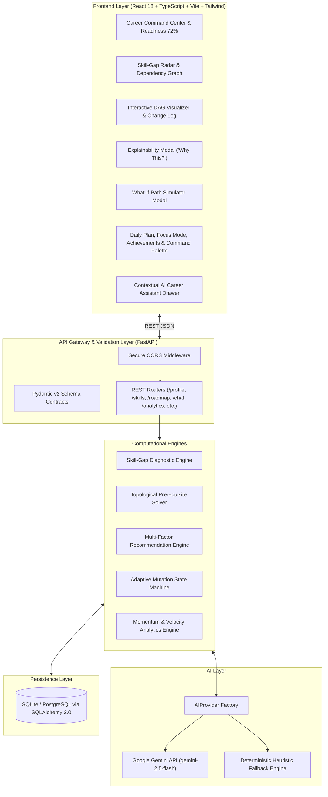

# PathFinder AI — Intelligent Career Navigation & Adaptive Roadmap Engine

> *"Your goal. Your gaps. Your personalized path."*

PathFinder AI is a production-grade, enterprise-ready **AI Career Command Center** and adaptive roadmap navigation platform. Built with a dual-core hybrid architecture combining **graph-theoretic Directed Acyclic Graph (DAG) prerequisite solving** with **Google Gemini generative intelligence**, PathFinder transforms free-form career goals into actionable, explainable, and continuously adaptive learning journeys.

---

## 🌟 Hackathon Highlights & Core Differentiators

| Innovation | Implementation | Value to Learner |
| :--- | :--- | :--- |
| **Skill-Gap Radar Diagnostics** | 6-axis quantitative competency measurement against industry benchmarks with importance weights. | Identifies exact proficiency deltas and prioritizes critical bottlenecks. |
| **Topological Prerequisite DAG Engine** | Strict Kahn's DAG sorting preventing cognitive overload by locking downstream topics. | Guarantees foundational topics (Statistics, Linear Algebra) precede advanced nodes (Neural Nets, MLOps). |
| **Explainable AI ("Why this?")** | Transparent 10-factor composite scoring formula with natural language justification. | Full clarity into why a resource was chosen and how it closes specific gaps. |
| **Autonomous Adaptive Recalibration** | Event-driven state machine reacting to quiz scores ($< 50\%$ injects remedials, $> 85\%$ accelerates). | Dynamic roadmap adjustments ensuring learning is never too slow or too overwhelming. |
| **What-If Roadmap Simulator** | Interactive slider modeling variable weekly study commitments (2h–40h/wk). | Live comparative analysis of timeline deltas, task counts, and graduation dates. |
| **Skill Momentum & Velocity** | Continuous competency growth tracking ($+8\%$ velocity) and planned vs actual pacing status. | Quantifies learning trajectory with `Ahead`, `On Track`, or `Behind` classifications. |
| **Smart Streak (Meaningful Activity)** | Rewards validated milestones (diagnostic quizzes $\ge 70\%$, project capstones) rather than logins. | Authentic engagement tracking with multiplier point incentives. |
| **Career Goal Comparator** | Side-by-side role transferability matrix (e.g. AI/ML Engineer vs Data Scientist). | Computes skill overlap percentage and tailored AI transition advice. |
| **Command Palette & Power UX** | Global launcher (`Ctrl/Cmd + K` and `/`), 2-Hour Daily Plan, Distraction-Free Focus Mode, Printable PDF Export. | Seamless developer-grade keyboard navigation and study immersion. |
| **Dual-Core Offline Resilience** | Abstract `AIProvider` factory with automated zero-downtime deterministic fallback. | 100% uptime with zero crashes even if external AI API keys are unset or rate-limited. |

---

## 📐 System Architecture



---

## 🚀 Quick Start Guide

### Prerequisites
- Python 3.11+
- Node.js 18+ / npm

### 1. Backend Setup & Test Suite
```bash
cd backend
python -m venv venv
# On Windows:
.\venv\Scripts\activate
# On macOS/Linux:
source venv/bin/activate

pip install -r requirements.txt
cp .env.example .env  # Optional: Add GEMINI_API_KEY if available

# Run full automated test suite (29/29 tests)
python -m pytest tests -v

# Start FastAPI production server (http://localhost:8000)
python -m uvicorn app.main:app --reload --port 8000
```

### 2. Frontend Setup & Build
```bash
cd frontend
npm install

# Run TypeScript + Vite production build
npm run build

# Start frontend development server (http://localhost:5173)
npm run dev
```

---

## 🎬 3-Minute Hackathon Demo Flow

1. **Landing Page (`/`)**: Greeted by a clean, modern AI SaaS interface. Click **"Try Demo Learner"**.
2. **Career Command Center (`/dashboard`)**: Instantly hydrated profile for *Alex Morgan* (AI/ML Engineer, 10h/week, 72% Readiness).
3. **Skill-Gap Diagnostics (`/skill-gap`)**: Multi-axis radar chart showing Statistics (45% gap) and ML (65% gap) as critical bottlenecks.
4. **Interactive Roadmap (`/roadmap`)**: Explore prerequisite DAG phase hierarchy and the chronological **Adaptive Change Log**.
5. **Recommendations (`/recommendations`)**: Click **"Why this?"** on any resource to view transparent 10-factor score breakdowns.
6. **Diagnostic Assessment (`/assessments`)**: Take a quiz and submit a mediocre score (38%) to watch the **Adaptive Recalibration Engine** inject remedial micro-modules in real time.
7. **What-If Simulator (`TopNav -> Simulate Path` or `Ctrl+K`)**: Adjust weekly study hours to 20h/week to see graduation timeline compress from 6 to 3.3 months.
8. **Power Tools**: Open **Today's Daily Plan** (2-hour timebox), enter **Focus Mode**, check **Achievements**, or ask the **AI Assistant** (*"I only have 2 hours today"*).

---

## 📚 Technical Documentation Index

Complete in-depth specifications and architectural whitepapers are available in the `docs/` directory:

- [`01-problem.md`](file:///c:/New%20folder/PathFinder%20AI/docs/01-problem.md) — The EdTech Navigational Gap & Core Thesis
- [`02-solution.md`](file:///c:/New%20folder/PathFinder%20AI/docs/02-solution.md) — The 6 Pillars of PathFinder AI
- [`03-user-journey.md`](file:///c:/New%20folder/PathFinder%20AI/docs/03-user-journey.md) — Complete Step-by-Step User Journey & Sequence Diagrams
- [`04-system-architecture.md`](file:///c:/New%20folder/PathFinder%20AI/docs/04-system-architecture.md) — System Architecture, Data Flow & Relational Schemas
- [`05-ai-architecture.md`](file:///c:/New%20folder/PathFinder%20AI/docs/05-ai-architecture.md) — Dual-Core Hybrid AI Architecture & Prompt Grounding
- [`06-skill-gap-algorithm.md`](file:///c:/New%20folder/PathFinder%20AI/docs/06-skill-gap-algorithm.md) — Mathematical Formulation of Skill Gap & Confidence Metrics
- [`07-recommendation-engine.md`](file:///c:/New%20folder/PathFinder%20AI/docs/07-recommendation-engine.md) — 10-Factor Multi-Criteria Scoring Algorithm
- [`08-adaptive-learning.md`](file:///c:/New%20folder/PathFinder%20AI/docs/08-adaptive-learning.md) — Adaptive State Machine & Topological Recalibration
- [`09-features.md`](file:///c:/New%20folder/PathFinder%20AI/docs/09-features.md) — Complete Features & Capabilities Catalog
- [`10-innovation.md`](file:///c:/New%20folder/PathFinder%20AI/docs/10-innovation.md) — Innovation & Differentiators Quadrant Analysis
- [`11-technology-stack.md`](file:///c:/New%20folder/PathFinder%20AI/docs/11-technology-stack.md) — Engineering Specifications & Dependency Matrix
- [`12-challenges.md`](file:///c:/New%20folder/PathFinder%20AI/docs/12-challenges.md) — Engineering Challenges & Technical Solutions
- [`13-future-scope.md`](file:///c:/New%20folder/PathFinder%20AI/docs/13-future-scope.md) — Long-Term Evolution & Enterprise Reskilling Roadmap

---

## 🔒 Security & Privacy

PathFinder AI enforces strict security standards, input sanitization, Pydantic v2 contract validation, and AI prompt safety. For vulnerability reporting guidelines and our security architecture, see [SECURITY.md](SECURITY.md).

---

## 📄 License

This project is licensed under the **MIT License** — see the [LICENSE](LICENSE) file for details.
