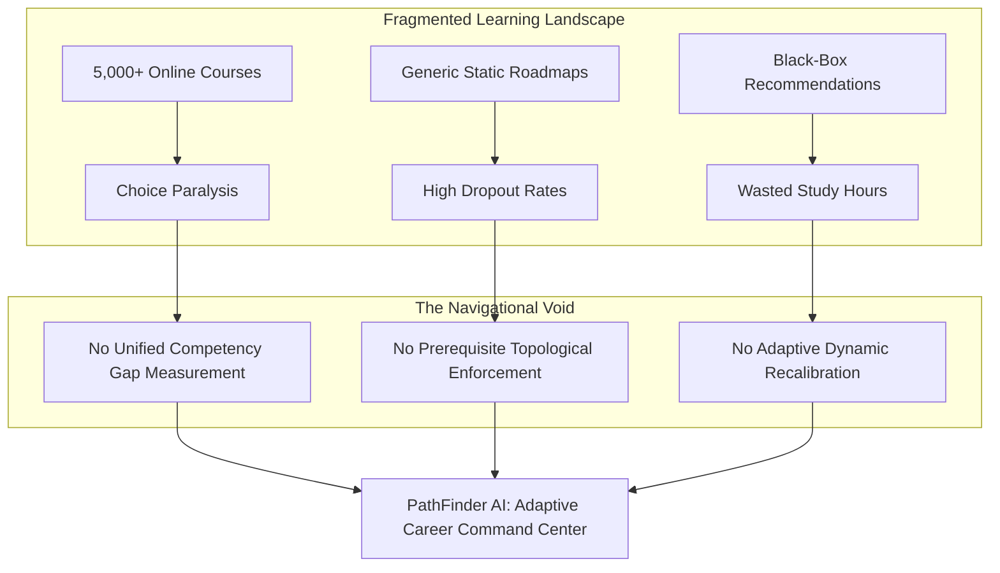

# 01 — Problem Understanding: The Career Navigational Gap

## The Modern EdTech Paradox: Abundance of Content, Scarcity of Direction

The global online education and upskilling market hosts millions of courses, tutorials, and certifications across platforms like Coursera, edX, Udemy, YouTube, and specialized bootcamps. Yet, despite infinite learning material, aspiring engineers encounter profound friction when attempting to achieve career transitions into high-demand technical roles (e.g., AI/ML Engineer, Data Scientist, Full Stack Developer, Cloud Engineer).

---

## The 5 Core Pain Points

### 1. Information Overload & Choice Paralysis
Aspiring career switchers face hundreds of courses for every topic. Lacking diagnostic clarity, they get trapped in "tutorial hell"—consuming introductory courses repeatedly without making tangible progress toward industry benchmarks.

### 2. Disregard for Prerequisite Dependency DAGs
Traditional platforms recommend courses based on popularity or collaborative filtering. A learner interested in "Deep Learning" is often shown advanced transformer architectures before mastering foundational prerequisites like multivariable calculus, linear algebra, and probability distributions—leading to frustration and eventual abandonment.

### 3. Black-Box Recommendations
Most recommendation algorithms act as opaque black boxes. Learners are given recommendations without explanations, unable to determine:
- *Why* this course is relevant to their target career.
- *Which specific skill gap* it targets.
- *What return on investment* they will achieve for their weekly time commitment.

### 4. Static, Rigid Learning Paths
Standard curriculum designs are linear and unyielding. If a learner scores 40% on an assessment, traditional platforms blindly march forward to the next module. Conversely, if a learner already has mastery over syntax, they are forced through redundant modules.

### 5. The Time Budget Disconnect
Adult learners operate under strict weekly constraints (e.g., 8–15 hours/week). Existing roadmaps fail to account for velocity, leading to unrealistic deadlines and uncalibrated expectations.

---

## The PathFinder Thesis

> **"A learner's roadmap should be a living, topological directed acyclic graph (DAG) that continuously measures competency deltas, enforces prerequisite dependencies, explains every recommendation, and autonomously adapts to assessment feedback and time constraints."**
