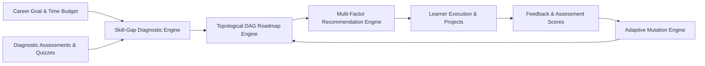

# 02 — Proposed Solution: PathFinder AI Career Navigation System

## Architectural Overview

PathFinder AI transforms career transitions into a closed-loop, data-driven optimization process. Rather than acting as another video repository, PathFinder serves as an **AI-powered Career Command Center** that aggregates, sequences, evaluates, and dynamically adapts educational resources around the learner's real-time skill gaps.

---

## The 6 Pillars of PathFinder

### 1. Taxonomy-Grounded Skill Gap Intelligence
- Standardized career benchmarks for major high-growth tech tracks.
- Multi-axis competency radar and weighted gap scoring formula:
  $$\text{Gap}_i = \max(0, \text{Required}_i - \text{Current}_i)$$
- Priority classification: *Critical Gap*, *Needs Attention*, *Developing*, and *Strong*.

### 2. Topological Prerequisite DAG Graph
- Direct Acyclic Graph ordering ensures that foundational prerequisites (e.g. *Python*, *Statistics*, *Linear Algebra*) strictly precede complex downstream nodes (*Neural Networks*, *Transformers*, *MLOps*).
- Eliminates cognitive overload and prevents tutorial abandonment.

### 3. Explainable Multi-Factor Recommendation Engine
- Deterministic scoring combining 10 distinct dimensions (gap reduction, prerequisite satisfaction, difficulty fit, time budget fit, rating, quality, learning style).
- Transparent **"Why This?"** reasoning modal detailing current proficiency, expected outcome, and score breakdown.

### 4. Autonomous Adaptive Learning Engine
- Triggered by assessment scores, user difficulty feedback, and study velocity.
- Score $< 50\% \implies$ Injects targeted remedial micro-lessons and reinforcement topics.
- Score $> 85\% \implies$ Bypasses introductory material, saves estimated study hours, and unlocks advanced downstream milestones.

### 5. Verified Hands-On Milestones & Projects
- Synthesizes theory with portfolio-grade capstones (e.g. *Customer Churn Prediction*, *YOLOv8 Computer Vision Pipeline*, *RAG Application*).
- Tracks measurable milestone achievements rather than passive video completions.

### 6. Interactive What-If Simulator & Advanced UX Analytics
- Real-time simulation of variable study commitments (e.g. 5 vs 20 hours/week) with dynamic milestone date shifts.
- Skill Momentum ($+8\% \text{ velocity}$), Smart Streaks, 2-Hour Daily Plans, Distraction-Free Focus Mode, and Command Palette navigation.
