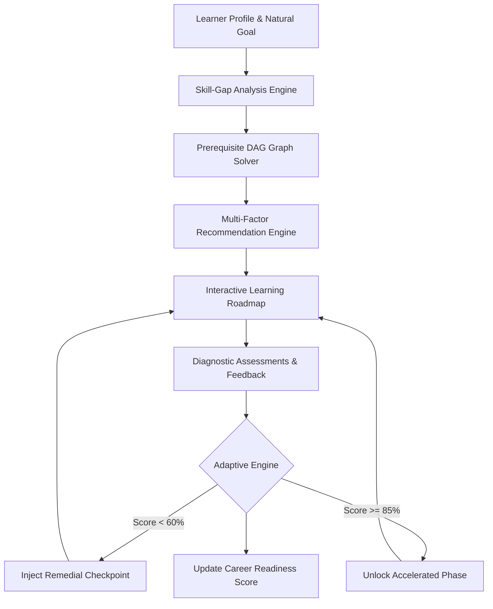

# 02 — Proposed Solution: PathFinder

## Solution Overview

**PathFinder** is an intelligent, AI-powered learning path recommender and autonomous roadmap navigator. Rather than functioning as a generic course directory, PathFinder acts as a personal AI career mentor that continuously evaluates competency gaps, enforces strict prerequisite dependencies, and adapts dynamically to learner performance.

## Key Solution Pillars

1. **Natural Language Goal Extraction**: Learners express goals in free-form language ("I know Python and SQL but I'm weak in stats; want an AI job in 6 months"). The NLP parser extracts structured targets and weaknesses.
2. **Deterministic Skill-Gap Mapping**: Quantifies exact proficiency deltas against verified career benchmarks (e.g. AI/ML Engineer vs Data Scientist).
3. **Graph-Based Prerequisite Intelligence**: Uses a Directed Acyclic Graph (DAG) to guarantee learners master essential foundations before advancing.
4. **Explainable AI Recommendations ("Why this?")**: Transparent multi-factor scoring (Gap 30%, Goal 20%, Prereq 15%, Difficulty 10%, Style 10%, Time 5%, Feedback 5%, Performance 5%).
5. **Real-Time Adaptive Learning**: Assessment scores and user ratings trigger instant roadmap mutations and skill confidence recalculation.
6. **Dynamic What-If Simulation**: Lets learners simulate the impact of varying weekly study hours (e.g. 5 vs 15 hrs/wk) on their target graduation date.
