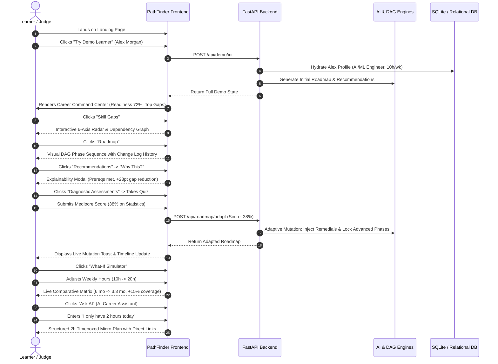

# 03 — End-to-End User Journey & Hackathon Demo Flow

## Complete Hackathon Demo Sequence (3–5 Minutes)

PathFinder provides a frictionless, high-impact demonstration flow showcasing intelligence across every step of the learner lifecycle.

---

## Step-by-Step Experience Breakdown

### 1. Landing & Instant Demo Hydration
- Visitors are greeted by the clean, Linear/Notion-inspired landing page.
- A single click on **"Try Demo Learner"** loads Alex Morgan (Intermediate AI/ML Engineer candidate with 10h/week study budget), immediately populating all database records.

### 2. The Career Command Center (Dashboard)
- **Career Readiness Index (72%)** with component breakdown (Technical, Projects, Assessments, Consistency).
- **Next Best Action Hero Card** with direct continuation CTA and expected gap reduction impact.
- **Real-Time Skill Momentum Strip** ($+8\%$ growth velocity).
- **Smart Streak** showing authentic validated milestones rather than empty logins.

### 3. Deep Skill-Gap Diagnostics
- **Multi-Axis Radar Chart** comparing current proficiency against target role benchmarks.
- **Topological Dependency Graph** illustrating unlocked and locked skill paths.
- **Interactive Table & Drawer** providing deep dives into evidence sources and prerequisites.

### 4. Interactive Prerequisite DAG Roadmap
- Displays structured sequential phases (Foundations $\rightarrow$ Statistics $\rightarrow$ Machine Learning $\rightarrow$ Deep Learning $\rightarrow$ MLOps $\rightarrow$ Capstone).
- **Adaptive Change Log** timeline recording chronological AI mutations (reinforcements added, syntaxes bypassed).

### 5. Multi-Factor Recommendations & "Why This?"
- Recommendations scored via 10 objective criteria.
- Transparent explainability modal justifying recommendation match percentage and alignment with time budget.

### 6. Assessment & Live Adaptive Mutation
- Taking a diagnostic quiz dynamically tests knowledge.
- Submitting a score of 38% triggers PathFinder's autonomous adaptive engine:
  - Updates skill confidence in real-time.
  - Injects remedial micro-lessons into the active roadmap phase.
  - Temporarily locks advanced downstream topics until remediation is verified.

### 7. What-If Path Simulator & Command Center
- Sliders allow instant scenario modeling (e.g., doubling study hours to 20h/week or switching to project-heavy curriculum).
- Power-user keyboard navigation (`Ctrl+K` and `/`) provides instant command execution.
