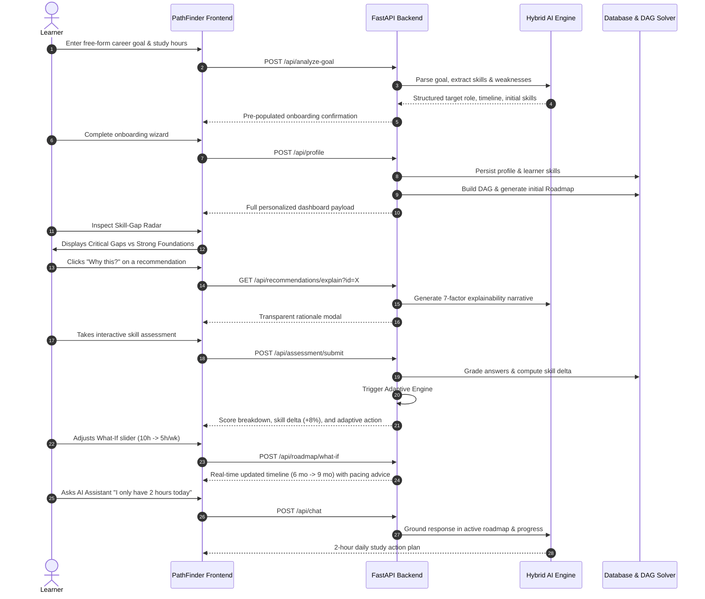

# 03 — End-to-End User Journey

PathFinder provides a seamless, intuitive journey for both new learners and evaluators.

## Step-by-Step Flow

```mermaid
sequenceDiagram
    autonumber
    actor Learner
    participant UI as PathFinder Frontend
    participant API as FastAPI Backend
    participant AI as Hybrid AI Engine
    participant DB as Database & DAG Solver

    Learner->>UI: Enter free-form career goal & study hours
    UI->>API: POST /api/analyze-goal
    API->>AI: Parse goal, extract skills & weaknesses
    AI-->>API: Structured target role, timeline, initial skills
    API-->>UI: Pre-populated onboarding confirmation

    Learner->>UI: Complete onboarding wizard
    UI->>API: POST /api/profile
    API->>DB: Persist profile & learner skills
    API->>DB: Build DAG & generate initial Roadmap
    API-->>UI: Full personalized dashboard payload

    Learner->>UI: Inspect Skill-Gap Radar
    UI->>Learner: Displays Critical Gaps vs Strong Foundations

    Learner->>UI: Clicks "Why this?" on a recommendation
    UI->>API: GET /api/recommendations/explain?id=X
    API->>AI: Generate 7-factor explainability narrative
    API-->>UI: Transparent rationale modal

    Learner->>UI: Takes interactive skill assessment
    UI->>API: POST /api/assessment/submit
    API->>DB: Grade answers & compute skill delta
    API->>API: Trigger Adaptive Engine
    API-->>UI: Score breakdown, skill delta (+8%), and adaptive action

    Learner->>UI: Adjusts What-If slider (10h -> 5h/wk)
    UI->>API: POST /api/roadmap/what-if
    API-->>UI: Real-time updated timeline (6 mo -> 9 mo) with pacing advice

    Learner->>UI: Asks AI Assistant "I only have 2 hours today"
    UI->>API: POST /api/chat
    API->>AI: Ground response in active roadmap & progress
    AI-->>UI: 2-hour daily study action plan
```
