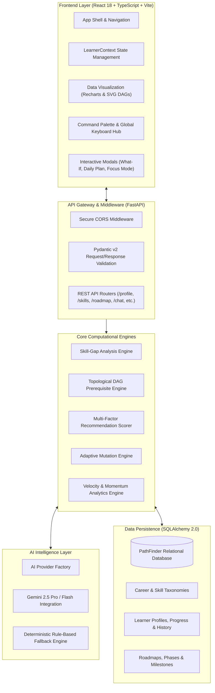

# 04 — System Architecture & Data Engineering

## High-Level System Architecture

PathFinder AI utilizes a modern, resilient, and decoupled client-server architecture built on FastAPI, SQLite/PostgreSQL with SQLAlchemy 2.0 ORM, and React 18 + Vite + TypeScript.

---

## Component Breakdown

### 1. Frontend Client Application
- **Framework**: React 18 with TypeScript in strict mode.
- **Styling**: Tailwind CSS v3 with custom design system variables (subtle borders, restrained dark theme palette, typography hierarchies).
- **Visualization**: Recharts for multi-axis radar charts and velocity line graphs; custom SVG rendering for interactive topological dependency DAGs.
- **State Management**: `LearnerContext` providing unified hydration, active profile tracking, modal state orchestration, and keyboard shortcut event listeners (`/` and `Ctrl/Cmd+K`).

### 2. Backend Application & API Layer
- **Framework**: FastAPI (Python 3.11+).
- **API Standards**: RESTful endpoints with comprehensive OpenAPI/Swagger automated documentation (`/docs`).
- **Data Validation**: Strict Pydantic v2 schemas guaranteeing type safety and contract integrity across all payloads.

### 3. Computational Engines
- **Skill-Gap Engine**: Performs multidimensional gap analysis and importance-weighted prioritization.
- **Topological DAG Solver**: Resolves dependency graphs using Kahn's algorithm, enforcing prerequisites before unlocking downstream topics.
- **Recommendation Scorer**: Multi-criteria weighted normalization algorithm computing match percentages ($0 - 100\%$).
- **Adaptive Engine**: Real-time state machine mutating roadmap phases based on quiz performance and pacing telemetry.

### 4. Database Schema & Data Modeling
- **Entities**: Users, Learner Profiles, Career Goals, Skills, Career Skills, Prerequisites, Learning Resources, Roadmaps, Phases, Roadmap Items, Assessments, Questions, Attempts, Projects, Feedback, AI Insights.
- **Relationships**: Fully indexed foreign keys with cascading delete safety.
