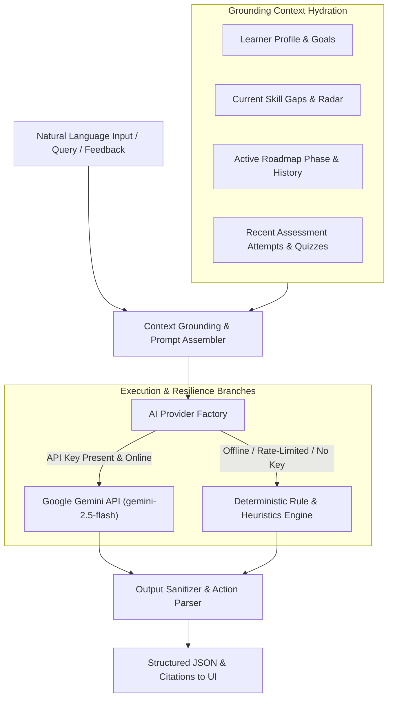

# 05 — AI & Machine Learning Architecture

## Dual-Core Hybrid AI Architecture

PathFinder AI combines modern **Large Language Model (LLM) intelligence** with **deterministic, graph-theoretic rule systems**. This hybrid architecture delivers personalized reasoning and conversational depth while guaranteeing strict prerequisite validity and latency resiliency.

---

## AI Capabilities & Functional Modules

### 1. Natural Language Career Goal Extraction (`/api/analyze-goal`)
- **Task**: Converts free-form learner input (e.g., *"I want to become an AI engineer in 6 months studying 10 hours a week with some Python background"*) into structured parameters.
- **Output Schema**:
  - Target Career Goal (`AI/ML Engineer`)
  - Target Timeline (`6 months`)
  - Weekly Hours (`10 hours`)
  - Extracted Known Skills (`Python 60%`, `SQL 50%`)
  - Identified Weak Areas (`Statistics`, `Machine Learning`)
  - Preferred Learning Style (`Hands-on / Project-based`)

### 2. Context-Aware AI Career Assistant (`/api/chat`)
- **Task**: Provides action-oriented, contextual guidance grounded in the learner's live profile, rather than generic chatbot answers.
- **Grounded Behaviors**:
  - *"What should I learn next?"* $\implies$ Identifies current bottleneck prerequisite and returns direct roadmap link.
  - *"I only have 2 hours today"* $\implies$ Synthesizes a 45m lesson, 30m code lab, 30m quiz, and 15m review with deep-links.
  - *"Can I skip this?"* $\implies$ Evaluates downstream prerequisite dependencies and provides a test-out assessment link if viable.

### 3. Dynamic Assessment Generator
- **Task**: Generates high-quality MCQ, Conceptual, and Scenario-based diagnostic questions across Beginner, Intermediate, and Advanced tiers tailored to the target skill.

### 4. Transparent Explainability Generation ("Why This?")
- **Task**: Produces natural-language justifications articulating how each resource satisfies unmet prerequisites, fits time budgets, and accelerates graduation milestones.

---

## Offline & Fault-Tolerant Deterministic Fallback

PathFinder implements a full-featured `MockAIProvider` with structured templates and deterministic heuristics. If Gemini API quotas are exhausted or network connectivity is severed:
1. All core functionalities remain 100% operational.
2. Explanations, chat responses, goal extractions, and diagnostic quizzes continue to generate instant, grounded outputs.
3. No 500 errors or broken states are ever exposed to the end user.
