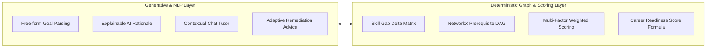

# 05 — AI / ML Architecture

PathFinder uses a **hybrid AI architecture** that pairs generative language models with deterministic graph solvers and mathematical scoring heuristics.

## 1. Natural Language Goal Parsing
When a user describes their goal conversationally, PathFinder uses semantic extraction to identify:
- Target career path (mapped to verified taxonomies)
- Experience tier (Beginner, Intermediate, Advanced)
- Target timeline in months (regex & token analysis)
- Stated strengths (e.g. Python, SQL)
- Stated weaknesses (e.g. Statistics, MLOps)
- Weekly hours and learning style affinity

## 2. Explainable AI Generation
Rather than outputting a raw match score, the AI generates personalized 2-3 sentence rationales explaining:
- The identified gap delta for the target career
- The prerequisite validation state
- How the duration fits the learner's weekly commitment
- Why the medium (hands-on / video / reading) aligns with user preferences

## 3. Persistent Conversational AI Companion
Grounded directly in the learner's profile, active roadmap node, career readiness score, and available weekly hours. Can generate immediate customized daily study blocks (e.g. "I only have 2 hours today").
