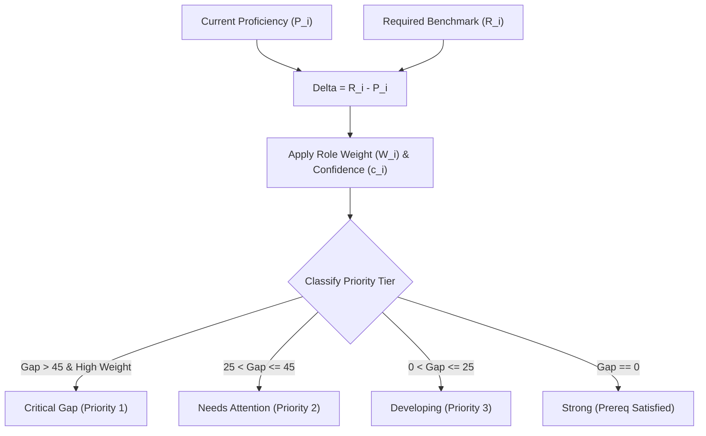

# 06 — Skill-Gap Algorithm & Diagnostic Engine

## Mathematical Formulation & Taxonomy Grounding

PathFinder calculates the multidimensional delta between a learner's demonstrated proficiencies and standardized industry role benchmarks using a rigorous weighted gap formula.

---

## 1. Skill Gap Calculation

For any given career goal $C$, let $S_C = \{s_1, s_2, \dots, s_n\}$ be the set of required skills. For each skill $s_i \in S_C$:

- $R_i \in [0, 100]$ is the **Required Proficiency** benchmark.
- $P_i \in [0, 100]$ is the learner's **Current Proficiency**.
- $W_i \in [0.5, 2.0]$ is the **Importance Weight** for role $C$.
- $c_i \in [0.1, 1.0]$ is the **Confidence Score** of the skill measurement.

The raw proficiency gap $G_i$ is defined as:

$$\Delta_i = R_i - P_i$$

$$G_i = \max(0, \Delta_i)$$

The **Weighted Gap Score** $\tilde{G}_i$ is defined as:

$$\tilde{G}_i = G_i \times W_i \times (1 + (1 - c_i) \times 0.2)$$

---

## 2. Overall Role Gap Score & Coverage

The learner's **Overall Gap Score** across all $n$ skills is:

$$\text{Overall Gap} = \frac{\sum_{i=1}^n \tilde{G}_i}{\sum_{i=1}^n (R_i \times W_i)} \times 100$$

The **Target Role Benchmark Coverage** is computed as:

$$\text{Benchmark Coverage} = 100 - \text{Overall Gap}$$

---

## 3. Priority Tier & Status Classification

Each skill $s_i$ is assigned a status based on $G_i$, $W_i$, and prerequisite positioning:

| Status | Condition | Action Taken |
| :--- | :--- | :--- |
| **Strong** | $G_i = 0$ or $P_i \ge R_i$ | Marked as satisfied; unlocks downstream child nodes in DAG |
| **Developing** | $0 < G_i \le 25$ | High proficiency; requires focused practice or milestone project |
| **Needs Attention** | $25 < G_i \le 45$ | Moderate deficit; scheduled in upcoming roadmap phase |
| **Critical Gap** | $G_i > 45$ and $W_i \ge 1.4$ | Immediate bottleneck; prioritized in Next Best Action and Phase 1–2 |

---

## 4. Prerequisite Confidence Decay & Calibration

Skill proficiency is updated via multiple weighted evidence sources:

| Evidence Source | Base Confidence $c_i$ | Update Weight |
| :--- | :--- | :--- |
| **Diagnostic Assessment ($\ge 80\%$)** | $0.90 - 0.95$ | $0.85$ (Primary) |
| **Capstone Project Submission** | $0.85 - 0.90$ | $0.80$ (High) |
| **GitHub Repository Activity** | $0.75 - 0.85$ | $0.70$ (Moderate) |
| **Completed Course Certificate** | $0.60 - 0.70$ | $0.50$ (Moderate) |
| **Self-Reported Initial Survey** | $0.30 - 0.50$ | $0.30$ (Low) |
