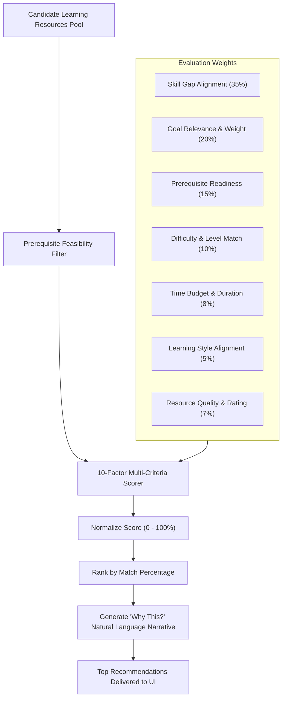

# 07 — Recommendation Engine & Multi-Criteria Scoring

## Multi-Factor Scoring Architecture

PathFinder does not hardcode recommendations or rely exclusively on popularity. It runs a **multi-criteria optimization function** that evaluates every learning resource $R$ against the learner's live profile $L$.

---

## 1. Mathematical Scoring Formula

For a candidate resource $r$ targeting skill $s$:

$$\text{FinalScore}(r, L) = \sum_{k=1}^7 w_k \cdot f_k(r, L)$$

Where the weights $\sum_{k=1}^7 w_k = 1.0$:

1. **Skill Gap Score ($w_1 = 0.35$)**:
   $$f_1(r, L) = \min\left(1.0, \frac{\text{Gap}(s)}{100}\right)$$
   *Resources addressing larger critical gaps receive higher priority.*

2. **Goal Importance ($w_2 = 0.20$)**:
   $$f_2(r, L) = \frac{\text{ImportanceWeight}(s, C)}{2.0}$$
   *Skills central to the career goal receive a proportional boost.*

3. **Prerequisite Match ($w_3 = 0.15$)**:
   $$f_3(r, L) = \begin{cases} 1.0 & \text{if all prerequisites are met} \\ 0.2 & \text{if prerequisites are unmet (penalty)} \end{cases}$$

4. **Difficulty Calibration ($w_4 = 0.10$)**:
   $$f_4(r, L) = 1.0 - 0.3 \times |\text{DifficultyRank}(r) - \text{LearnerTier}(L)|$$

5. **Time Budget Fit ($w_5 = 0.08$)**:
   $$f_5(r, L) = \exp\left(-\frac{|\text{Duration}(r) - \text{WeeklyTarget}(L)|}{2 \times \text{WeeklyTarget}(L)}\right)$$

6. **Learning Style Fit ($w_6 = 0.05$)**:
   $$f_6(r, L) = \begin{cases} 1.0 & \text{if style matches exactly} \\ 0.7 & \text{if mixed or partial match} \\ 0.4 & \text{otherwise} \end{cases}$$

7. **Quality & Rating ($w_7 = 0.07$)**:
   $$f_7(r, L) = \frac{\text{Rating}(r)}{5.0} \times \text{QualityScore}(r)$$

---

## 2. Recommendation Match Percentage

The final normalized match percentage is calculated as:

$$\text{Match Percentage} = \min(99, \max(50, \text{round}(\text{FinalScore}(r, L) \times 100)))$$

---

## 3. Transparent "Why This?" Explainability Schema

Every recommendation produces an explainability record returned by `/api/recommendations/explain`:
- **Target Skill**: e.g., *Statistics*
- **Current Proficiency vs Required**: e.g., $35\% \rightarrow 80\%$ (45% Gap)
- **Prerequisite Status**: e.g., *"All prerequisites (Python & Basic Algebra) are 100% verified."*
- **Estimated Time Commitment**: e.g., *12 hours (fits cleanly within your 10h/week pace).*
- **Expected Outcome**: e.g., *"Closes remaining distribution modeling deficit before Supervised Learning."*
- **AI Narrative Explanation**: Personalized 2-sentence rationale generated for the learner.
