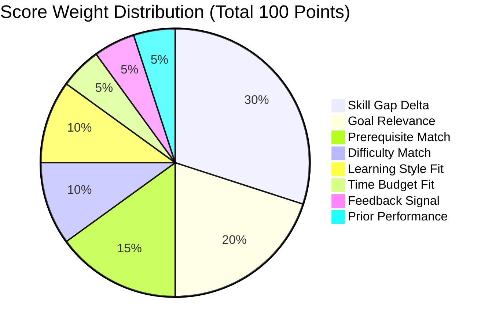

# 07 — Recommendation Engine & Scoring Algorithm

## Multi-Factor Scoring Formula

PathFinder evaluates all available learning resources against a 100-point composite score:

$$\text{Score} = S_{\text{gap}} + S_{\text{goal}} + S_{\text{prereq}} + S_{\text{diff}} + S_{\text{style}} + S_{\text{time}} + S_{\text{feedback}} + S_{\text{perf}}$$

### Component Breakdown

1. **Skill Gap Weight ($S_{\text{gap}}$, 30 pts)**:
   $$S_{\text{gap}} = \min\left(30, \frac{\text{Gap}_i}{\text{Required}_i} \times 30\right)$$
2. **Goal Relevance ($S_{\text{goal}}$, 20 pts)**:
   $$S_{\text{goal}} = \min(20, w_i \times 10)$$
3. **Prerequisite Match ($S_{\text{prereq}}$, 15 pts)**:
   $$S_{\text{prereq}} = \begin{cases} 15 & \text{if all prerequisites are met} \\ 3 & \text{otherwise} \end{cases}$$
4. **Difficulty Match ($S_{\text{diff}}$, 10 pts)**:
   $$S_{\text{diff}} = 10 - 4 \times |\text{UserLevel} - \text{ResourceLevel}|$$
5. **Learning Style Match ($S_{\text{style}}$, 10 pts)**:
   $$S_{\text{style}} = \begin{cases} 10 & \text{if exact format match or Mixed} \\ 9.5 & \text{if hands-on/project preference matches} \\ 5 & \text{otherwise} \end{cases}$$
6. **Time Budget Fit ($S_{\text{time}}$, 5 pts)**:
   $$S_{\text{time}} = \begin{cases} 5 & \text{if Duration} \le \text{WeeklyHours} \\ 3.5 & \text{if Duration} \le 2 \times \text{WeeklyHours} \\ 2 & \text{otherwise} \end{cases}$$
7. **Feedback Signal ($S_{\text{feedback}}$, 5 pts)**:
   Reinforces modules with "Just Right" user feedback and demotes difficulty levels previously flagged as "Too Difficult".
8. **Prior Performance ($S_{\text{perf}}$, 5 pts)**:
   Prioritizes skills with lower assessment confidence to reinforce retention.

## Priority Tiers
- **Top Match**: Score $\ge 82$
- **High Priority**: $68 \le \text{Score} < 82$
- **Recommended**: $50 \le \text{Score} < 68$
- **Optional**: $\text{Score} < 50$
