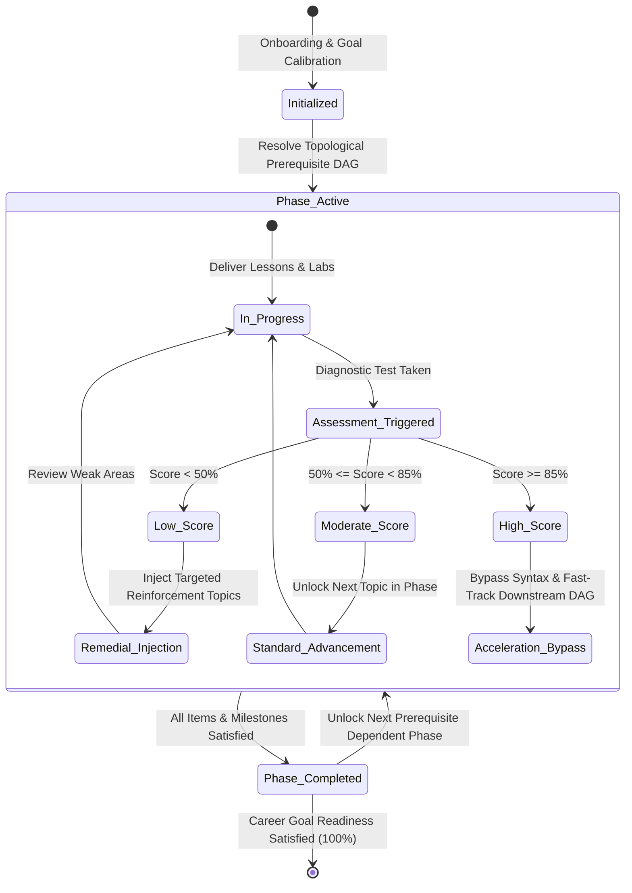

# 08 — Adaptive Learning Engine & Topological Roadmap Recalibration

## Dynamic Roadmap State Machine

PathFinder roadmaps are not static checklists. They operate as a **reactive, event-driven state machine** governed by assessment feedback, completion velocity, and cognitive load telemetry.

---

## 1. Adaptive Trigger Types

The adaptive engine (`POST /api/roadmap/adapt`) processes 5 distinct feedback signals:

| Trigger Event | Payload Parameters | Engine Response |
| :--- | :--- | :--- |
| **Assessment Score $< 50\%$** | Score, weak topics, difficulty rating | Injects remedial micro-modules; flags prerequisite as unverified |
| **Assessment Score $\ge 85\%$** | Score, skill name | Marks skill as verified; bypasses foundational lessons; updates readiness |
| **Learner Feedback: "Too Hard"** | Resource ID, feedback text | Inserts foundational bridge content; divides complex items into sub-steps |
| **Learner Feedback: "Too Easy"** | Resource ID, feedback text | Advances directly to hands-on capstone project; increases pacing |
| **Inactivity Alert ($> 14\text{ days}$)** | Days inactive | Generates 15-minute spaced retention review to rebuild momentum |

---

## 2. Topological Mutation & DAG Invariants

Whenever a mutation occurs, the engine re-runs the topological dependency solver to enforce strict graph invariants:

1. **Prerequisite Consistency**: No item in Phase $k+1$ can transition to `Available` or `In Progress` if its prerequisite parents in Phase $k$ have unmet proficiency thresholds ($< 60\%$).
2. **Remedial Placement**: Injected remedial topics are automatically ordered before downstream dependencies within the active phase.
3. **Change Log Tracking**: Every mutation appends an entry to the `RoadmapChangelog` table, preserving an immutable audit trail of learning path mutations.

---

## 3. Sample Real-World Adaptation Scenarios

### Scenario A: Struggling on Statistics (Score: 38%)
- **Trigger**: Diagnostic quiz on Bayes Theorem and Variance.
- **Action**: Injected 2 remedial micro-lessons (*"Probability Distribution Essentials"*, *"Bayesian Inference Visualized"*).
- **Log Entry**: *"Phase 2 Adapted: Linear Algebra & Probability Reinforcement Injected (Score: 38%)."*

### Scenario B: Testing Out of Python Fundamentals (Score: 96%)
- **Trigger**: Core Python test-out quiz.
- **Action**: Bypassed 3 introductory syntax modules, saving an estimated 14 hours of study time.
- **Log Entry**: *"Path Accelerated: Introductory Python Bypassed (Saved 14 hours)."*
