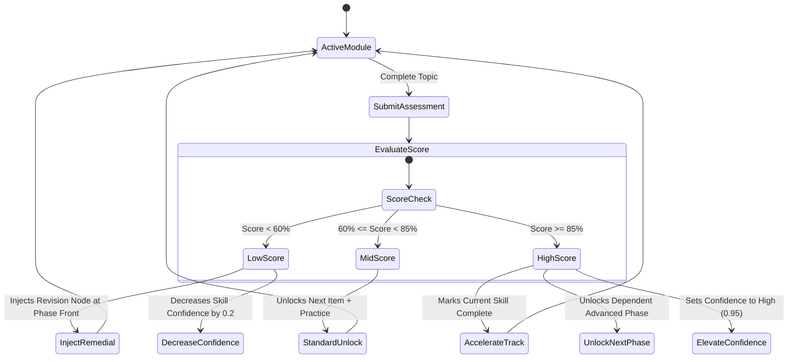

# 08 — Adaptive Learning & Dynamic Roadmaps

## Adaptive Mutation Lifecycle

Unlike static learning paths, PathFinder mutates the active roadmap in response to real learning events.

## Feedback Adaptation

When a learner marks an item as **"Too Difficult"**:
1. PathFinder immediately lowers the difficulty weighting for that skill tier.
2. Short, visual, and code-along tutorials are prioritized.
3. Supplementary review resources are highlighted in the Recommendations tab.

When a learner marks an item as **"Too Easy"**:
1. Introductory concepts are automatically marked completed.
2. The learner is invited to take a **Skill Test-Out Assessment** to bypass prerequisites.
