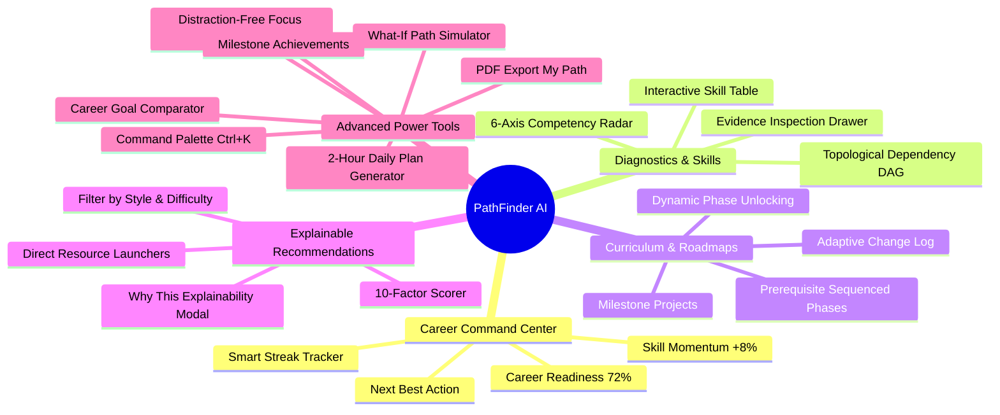

# 09 — Complete Features & Capabilities Catalog

PathFinder delivers a comprehensive suite of enterprise-grade AI analytics and learning workflow tools.

---

## Comprehensive Feature Matrix

### 1. Core Analytics & Overview
- **Career Readiness Score (0–100%)**: Multi-pillar composite metric breaking down technical mastery, project completions, assessment consistency, and role coverage.
- **Next Best Action Card**: Prioritized recommendation highlighting immediate prerequisite bottlenecks with estimated completion times and impact rationales.
- **Skill Momentum Indicators**: Live growth velocity tracking (e.g., `Machine Learning 42% ↑ +8%`).
- **Smart Streak Tracker**: Rewards meaningful learning milestones (assessments $\ge 70\%$, project submissions) with streak multipliers rather than superficial daily logins.

### 2. Skill-Gap Diagnostics
- **Interactive Multi-Axis Radar**: Visualizes current proficiency vs industry benchmark across 6+ competencies.
- **Topological Dependency Graph**: Interactive SVG nodes depicting prerequisite relationships and lock/unlock states.
- **Skill Detail Drawer**: Slide-out panel detailing evidence sources, confidence calibrations, and related projects.

### 3. Curriculum & Roadmaps
- **Prerequisite-Governed Phases**: Structured progression preventing cognitive overload.
- **Adaptive Mutation Change Log**: Immutable chronological timeline detailing autonomous AI reinforcements and accelerations.
- **Milestone Projects**: Real-world capstone assignments with starter templates and portfolio value ratings.

### 4. Explainable AI Recommendations
- **Multi-Factor Scorer**: Objective ranking across 10 dimensions.
- **"Why This?" Reasoning Modal**: Transparent natural-language justification with score breakdowns.

### 5. Advanced Power UX
- **What-If Roadmap Simulator**: Live sliders for weekly hours and deadlines with real-time comparison deltas.
- **Multi-Career Goal Comparator**: Side-by-side transition feasibility analysis between target roles.
- **2-Hour Daily Plan**: Timeboxed session generator (45m lesson, 30m code lab, 30m quiz, 15m review).
- **Distraction-Free Focus Mode**: Full-screen modal with countdown timer, active phase tags, and completion logging.
- **Milestone Achievements**: Visual badge system across Bronze, Silver, Gold, and Platinum tiers.
- **"Export My Path"**: PDF-ready printable audit report generated via `window.print()`.
- **Command Palette (`Ctrl+K` / `/`)**: Instant keyboard navigation hub.
