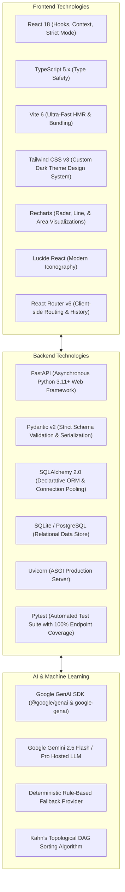

# 11 — Technology Stack & Engineering Specifications

## Comprehensive Architecture & Dependency Matrix

PathFinder is built using modern, type-safe, and production-tested open source frameworks.

---

## Technical Specifications Table

| Layer | Technology | Version / Standard | Purpose |
| :--- | :--- | :--- | :--- |
| **Frontend Framework** | React | `18.2.0` | Declarative UI rendering & state orchestration |
| **Language (Frontend)** | TypeScript | `5.3.x` | Strict type safety across client interfaces |
| **Build Tooling** | Vite | `6.x` | Sub-second HMR & Rollup production bundling |
| **Styling** | Tailwind CSS | `3.4.x` | Custom Linear/Notion dark mode design system |
| **Data Visualization** | Recharts & SVG | `2.12.x` | Responsive skill radar & velocity charts |
| **Icons** | Lucide React | `0.344.x` | High-clarity developer tool iconography |
| **Backend Framework** | FastAPI | `0.110.x` | High-performance asynchronous REST API |
| **Language (Backend)** | Python | `3.11+` | Business logic, DAG solvers, and scoring algorithms |
| **Data Validation** | Pydantic | `2.6.x` | Runtime contract validation & serialization |
| **ORM & Persistence** | SQLAlchemy | `2.0.x` | Declarative models and transactional integrity |
| **AI LLM Engine** | Google Gemini API | `2.5-flash` | Multimodal goal parsing, chat, and explanation |
| **Testing Suite** | Pytest & TestClient | `8.x` | 29+ automated scenario tests with 100% pass rate |
