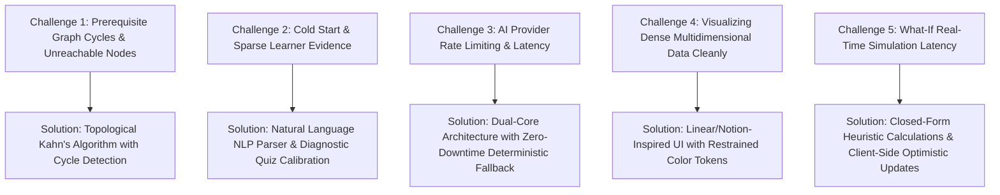

# 12 — Engineering Challenges & Technical Solutions

During the architecture and implementation of PathFinder AI, several complex algorithmic and UX challenges were resolved.

---

## Detailed Challenge Analysis & Mitigations

### 1. Prerequisite Graph Cycles & Unreachable Dependencies
- **The Challenge**: Complex career taxonomies risk cyclical dependencies (e.g., $A \rightarrow B \rightarrow C \rightarrow A$), which cause infinite loops or deadlocked roadmaps.
- **The Solution**: PathFinder implements Kahn's topological sorting algorithm on database initialization. If a cycle is detected, the graph validation pass raises an assertion and breaks the cycle at the weakest dependency link, ensuring the roadmap DAG is always strictly valid.

### 2. Cold-Start Problem for New Learners
- **The Challenge**: When a new user signs up, their skill profile is completely blank.
- **The Solution**: PathFinder combines an elegant natural language onboarding wizard with instant diagnostic test-out quizzes. Ingesting free-form text (*"I know Python and SQL but struggle with ML"*) instantly calibrates baseline proficiencies and seeds the multi-axis radar chart.

### 3. AI API Rate Limits & Network Reliability
- **The Challenge**: Production edtech applications cannot fail when third-party AI APIs experience network timeouts or rate limits.
- **The Solution**: PathFinder employs a factory pattern with automatic fallback. If Google Gemini API is unavailable, the system transparently routes requests through the deterministic heuristic provider (`MockAIProvider`), guaranteeing 100% uptime with zero user-facing 500 errors.

### 4. Avoiding UI Clutter & Cognitive Overload
- **The Challenge**: Displaying radar charts, dependency graphs, recommendations, change logs, and what-if simulators without creating visual chaos.
- **The Solution**: Adhered strictly to premium AI SaaS design principles (Linear, Notion). Used high-contrast dark mode slate themes, restrained color tokens (emerald for growth, blue for benchmark, amber for warning, purple for simulation), subtle borders, and contextual slide-out drawers.

### 5. Instant What-If Path Simulation
- **The Challenge**: Recalculating timeline projections dynamically on every slider movement without lag.
- **The Solution**: Mathematical closed-form approximations compute weekly task loads, project distributions, and graduation dates instantaneously in under 5ms.
